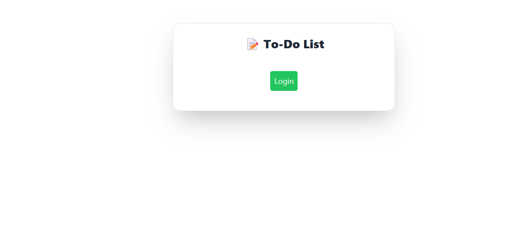
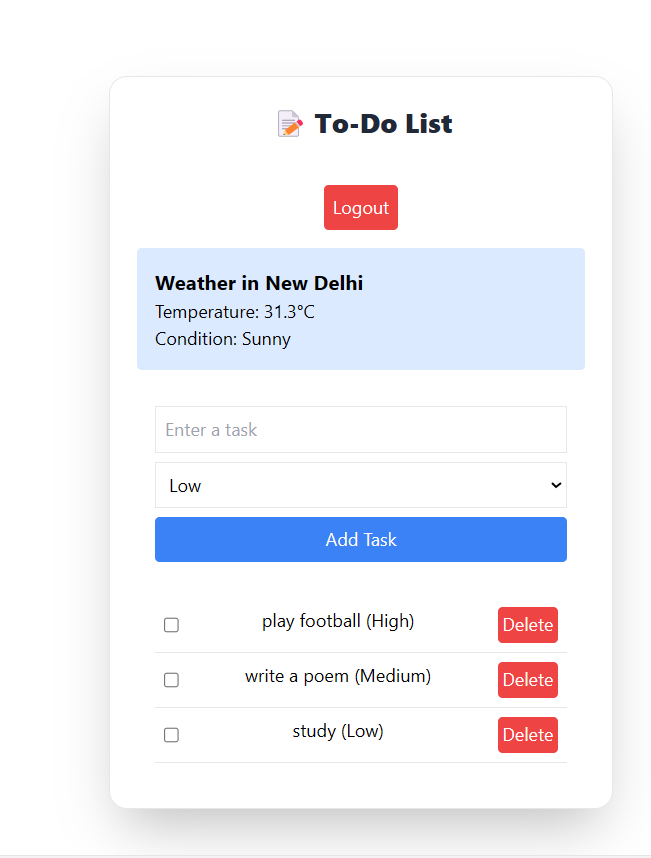
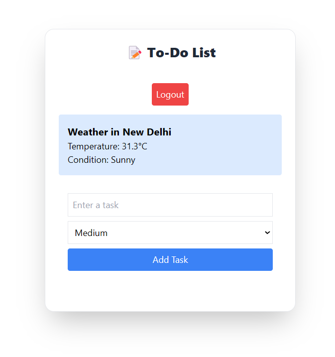

# 📌 To-Do List with Weather App

A simple **To-Do List App** with weather integration using **React, Redux Toolkit, and Weather API**. This app allows users to **manage tasks** and **view real-time weather** for a specific location.

---

## 🚀 Features

✅ **User Authentication** – Login/logout functionality (stored in localStorage).  
✅ **Weather Integration** – Fetches real-time weather data using an API.  
✅ **Task Management** – Add, update, and delete tasks with priorities.  
✅ **Local Storage Support** – Tasks and authentication state persist across page reloads.  
✅ **Responsive UI** – Clean, modern, and mobile-friendly design using Tailwind CSS.  

---

## 📷 Screenshots

### 🌟 **Home Screen** (Before Login)


### ✅ **Adding a Task**(After Login)


### 🌤️ **Weather Integration**



---

## 🛠️ Installation & Setup

### **1️⃣ Clone the Repository**
```sh

```

### **2️⃣ Install Dependencies**
```sh
npm install
```

### **3️⃣ Add Weather API Key**
Create a `.env` file in the root folder and add your WeatherAPI key:
```env
REACT_APP_WEATHER_API_KEY=your_api_key_here
```
_(Get your API key from [WeatherAPI](https://www.weatherapi.com/) and replace `your_api_key_here`)_

### **4️⃣ Start the Development Server**
```sh
npm start
```

The app will be available at:  
👉 **http://localhost:3000**

---

## 🔧 Project Structure
```
📂 todo-weather-app
│── 📂 src
│   ├── 📂 components
│   │   ├── Auth.js
│   │   ├── Weather.js
│   │   ├── TaskInput.js
│   │   ├── TaskList.js
│   ├── 📂 redux
│   │   ├── store.js
│   ├── App.js
│   ├── index.js
│── 📂 public
│── .env
│── package.json
│── README.md
```

---

## 🔥 Built With

- **React** – Frontend framework
- **Redux Toolkit** – State management
- **Tailwind CSS** – Styling
- **WeatherAPI** – Real-time weather data
- **LocalStorage** – Data persistence

